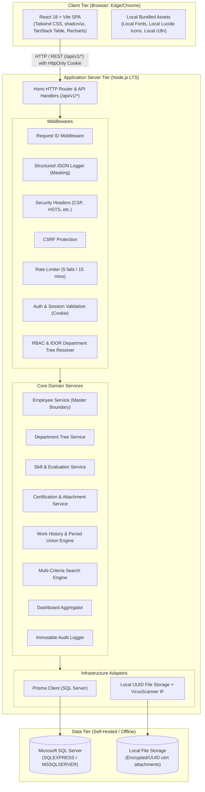

# システムアーキテクチャ設計書

## 1. システム全体構成図 (Mermaid)

## 2. レイヤードアーキテクチャ設計
1. **Presentation Layer (Frontend)**:
   - React SPA, TanStack Table, Recharts, i18next
   - サーバーサイドページネーション、アクセシビリティ、テーマ切替 (Light/Dark/System)
2. **Interface Layer (Backend Routes & Middlewares)**:
   - Hono REST API エンドポイント (`/api/v1/*`)
   - Zod によるリクエスト/レスポンスバリデーション
   - 認証、認可、セキュリティヘッダー、エラーハンドリング
3. **Application & Domain Layer (Services)**:
   - 部署階層トラバーサル、実務経歴期間Union計算、評価履歴記録、不変監査ログ生成
   - 外部社員マスタ連携を考慮したリポジトリ抽象化
4. **Infrastructure Layer (Data & Storage)**:
   - Prisma Client による SQL Server へのパラメータ化クエリ発行
   - 安全なUUIDファイルストレージ管理とVirusScanner抽象化
