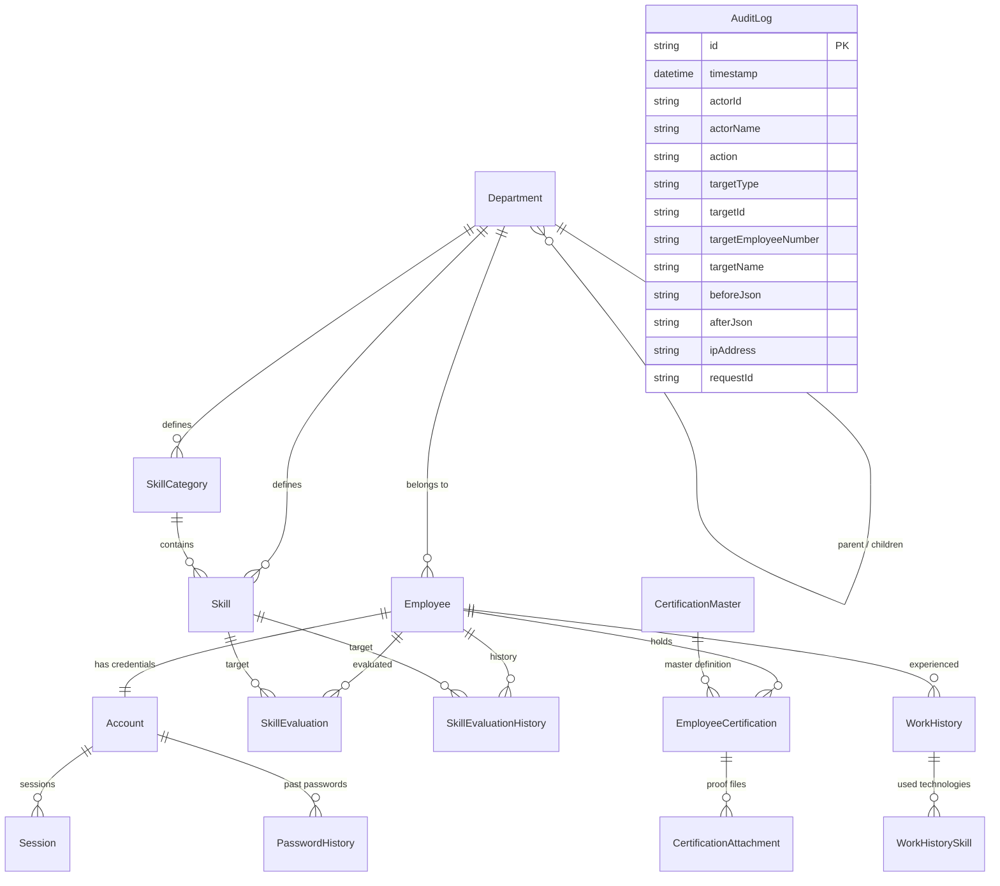

# データベース設計書 (ERD & インデックス設計)

## 1. 概念・論理データモデル (Mermaid ERD)

## 2. テーブル定義詳細

### 2.1 組織・部署 (`departments`)
| カラム名 | 型 | NULL | 既定値 | 説明 |
|---|---|---|---|---|
| `id` | VARCHAR(36) | NO | PK (UUID) | 部署ID |
| `code` | VARCHAR(50) | NO | UNIQUE | 部署コード |
| `name` | NVARCHAR(100) | NO | - | 部署名 |
| `parentId` | VARCHAR(36) | YES | FK (`departments.id`) | 親部署ID |
| `path` | VARCHAR(500) | NO | - | 階層パス (例: `/root/div1/dept2`) |
| `level` | INT | NO | 1 | 階層深度 (1: ルート) |
| `sortOrder` | INT | NO | 0 | 表示順 |
| `createdAt` | DATETIME2 | NO | CURRENT_TIMESTAMP | 作成日時 |
| `updatedAt` | DATETIME2 | NO | CURRENT_TIMESTAMP | 更新日時 |

- **インデックス**: `INDEX idx_departments_parentId (parentId)`, `INDEX idx_departments_path (path)`

### 2.2 社員 (`employees`)
| カラム名 | 型 | NULL | 既定値 | 説明 |
|---|---|---|---|---|
| `id` | VARCHAR(36) | NO | PK (UUID) | 社員ID |
| `employeeNumber` | VARCHAR(50) | NO | UNIQUE | 社員番号 |
| `name` | NVARCHAR(100) | NO | - | 氏名 |
| `nameKana` | NVARCHAR(100) | NO | - | 氏名カナ |
| `email` | VARCHAR(255) | NO | UNIQUE | メールアドレス |
| `departmentId` | VARCHAR(36) | NO | FK (`departments.id`) | 所属部署ID |
| `position` | NVARCHAR(50) | YES | - | 役職 (部長/課長/リーダー/一般等) |
| `role` | VARCHAR(20) | NO | `GENERAL` | システム権限 (`ADMIN`, `DEPARTMENT_MANAGER`, `GENERAL`) |
| `hireDate` | DATE | NO | - | 入社日 |
| `status` | VARCHAR(20) | NO | `ACTIVE` | 在籍状態 (`ACTIVE`, `ON_LEAVE`, `RETIRED`) |
| `notes` | NVARCHAR(MAX) | YES | - | 備考 |
| `createdAt` | DATETIME2 | NO | CURRENT_TIMESTAMP | 作成日時 |
| `updatedAt` | DATETIME2 | NO | CURRENT_TIMESTAMP | 更新日時 |

- **インデックス**: `INDEX idx_employees_departmentId (departmentId)`, `INDEX idx_employees_role (role)`, `INDEX idx_employees_name (name)`, `INDEX idx_employees_status (status)`

### 2.3 アカウント・認証 (`accounts`, `sessions`, `password_histories`)
- `accounts`: `id`, `employeeId` (UNIQUE, FK), `loginId` (UNIQUE), `passwordHash`, `isInitialPassword` (BOOLEAN), `failedLoginAttempts` (INT, default 0), `lockedUntil` (DATETIME2, nullable), `lastLoginAt`, `createdAt`, `updatedAt`
- `sessions`: `id`, `accountId` (FK), `tokenHash` (VARCHAR(64), UNIQUE), `expiresAt` (DATETIME2), `ipAddress`, `userAgent`, `createdAt`, `updatedAt`
- `password_histories`: `id`, `accountId` (FK), `passwordHash`, `createdAt`

### 2.4 スキル・評価 (`skill_categories`, `skills`, `skill_evaluations`, `skill_evaluation_histories`)
- `skill_categories`: `id`, `departmentId` (FK), `name`, `sortOrder`, `createdAt`, `updatedAt`
- `skills`: `id`, `categoryId` (FK), `departmentId` (FK), `name`, `notes`, `sortOrder`, `createdAt`, `updatedAt`
- `skill_evaluations`: `id`, `employeeId` (FK), `skillId` (FK), `selfLevel` (`A`\|`B`\|`C`\|`UNEVALUATED`), `managerLevel` (`A`\|`B`\|`C`\|`UNEVALUATED`), `selfEvaluatedAt`, `managerEvaluatedAt`, `managerEvaluatorId` (nullable, FK), `createdAt`, `updatedAt` -> **複合ユニーク制約**: `(employeeId, skillId)`
- `skill_evaluation_histories`: `id`, `evaluationId` (FK), `employeeId` (FK), `skillId` (FK), `evaluatorId` (FK), `evaluatorRole`, `evalType` (`SELF`\|`MANAGER`), `previousLevel`, `newLevel`, `reason`, `createdAt`

### 2.5 資格・添付ファイル (`certification_masters`, `employee_certifications`, `certification_attachments`)
- `certification_masters`: `id`, `name`, `issuer`, `category`, `createdAt`, `updatedAt`
- `employee_certifications`: `id`, `employeeId` (FK), `certificationMasterId` (FK, nullable), `customCertificationName` (nullable), `acquiredDate` (DATE), `expirationDate` (DATE, nullable), `certificateNumber` (nullable), `notes`, `createdAt`, `updatedAt`
- `certification_attachments`: `id`, `employeeCertificationId` (FK), `originalFileName`, `storedFileName` (UUID.ext), `filePath`, `fileSize`, `mimeType`, `sha256Hash`, `createdAt`

### 2.6 実務経歴 (`work_histories`, `work_history_skills`)
- `work_histories`: `id`, `employeeId` (FK), `projectName`, `description`, `role`, `startYearMonth` (VARCHAR(7), e.g. `2023-04`), `endYearMonth` (VARCHAR(7), nullable), `isCurrent` (BOOLEAN), `notes`, `createdAt`, `updatedAt`
- `work_history_skills`: `id`, `workHistoryId` (FK), `skillName`, `category` (nullable), `createdAt`

### 2.7 監査ログ (`audit_logs`)
- `id`, `timestamp`, `actorId`, `actorName`, `action`, `targetType`, `targetId`, `targetEmployeeNumber`, `targetName`, `beforeJson`, `afterJson`, `ipAddress`, `requestId`
- **インデックス**: `INDEX idx_audit_logs_timestamp (timestamp DESC)`, `INDEX idx_audit_logs_actorId (actorId)`, `INDEX idx_audit_logs_targetId (targetId)`
